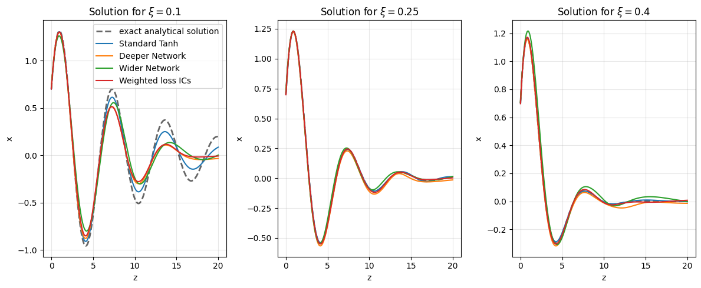
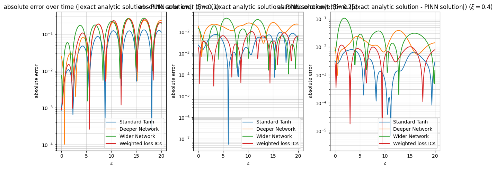
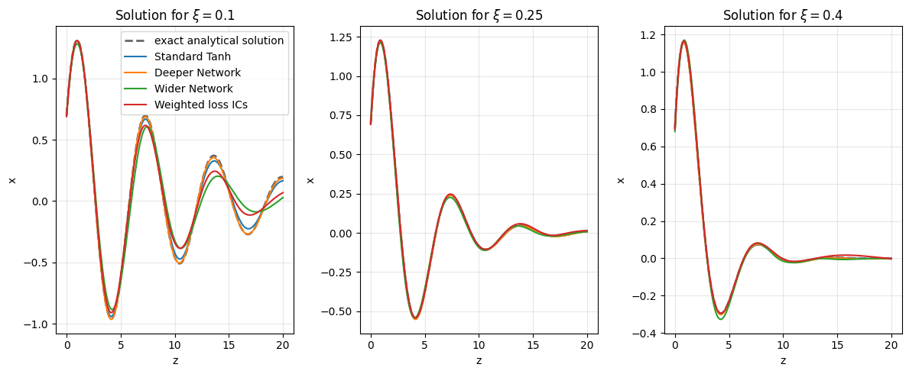
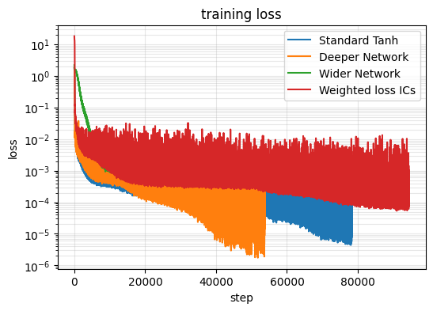
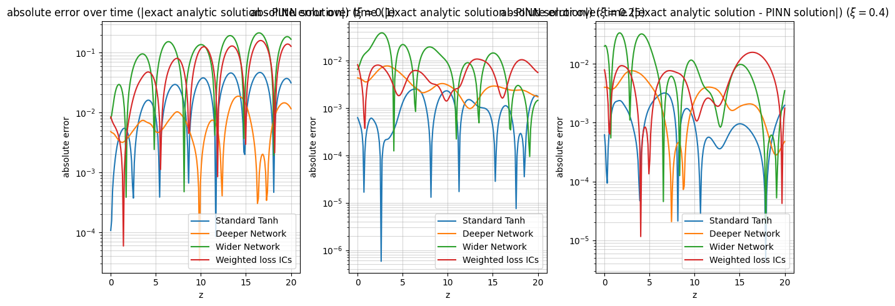
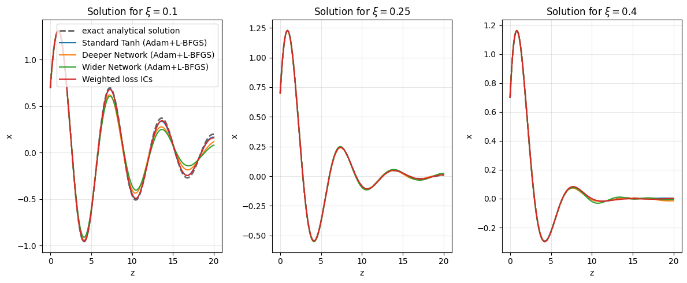
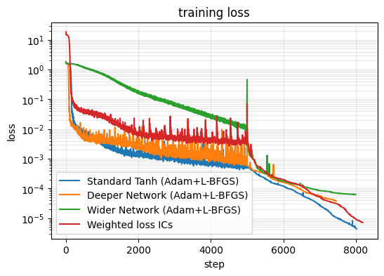
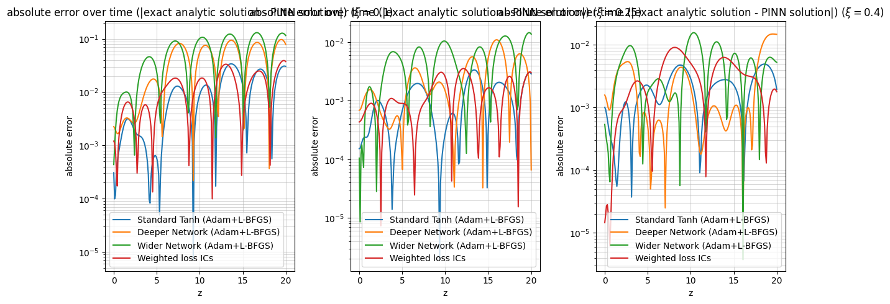
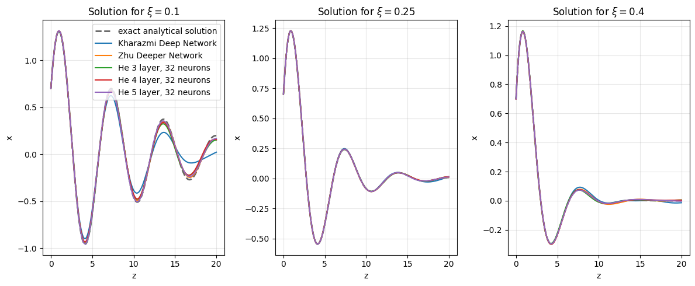
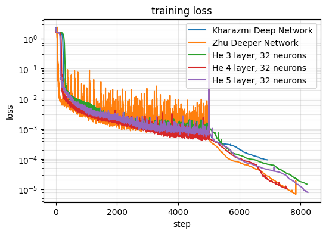

# Physics-Informed Neural Network for the Diffusion Equation (PINNDE)

**Author:** Conza Salvatore Angelo

---

## About

This project explores using **Physics-Informed Neural Networks (PINNs)** to build ultra-fast samplers that map an easy-to-sample density (e.g. an *n*-dimensional normal) to a desired *n*-dimensional target density. One promising approach computes this mapping by solving the **reverse-time diffusion equation** — an integro-differential equation whose integral term can be approximated via Monte Carlo integration ([Lu et al., 2022](https://arxiv.org/abs/2206.00927); [Liu et al., 2023](https://arxiv.org/abs/2310.14458)). Because solving this equation repeatedly is slow, neural networks are typically trained on pre-generated solutions.

Instead, this project investigates **modeling the diffusion equation solution directly with a PINN** ([Cuomo et al., 2022](https://arxiv.org/abs/2201.05624)). The large upfront training cost is amortized over fast subsequent sampling.

### Goals

1. **3D Normal → Non-Gaussian mapping via PINN** — Inputs: reverse time *t* ∈ [1, 0] and point (*x, y, z*) sampled from a 3D standard normal. Output: vector solution **u**(*t, x, y, z*). Training points use Sobol quasi-random sampling for uniform domain coverage.
2. **Increasingly complex 3D target densities.**
3. **Fast calorimeter simulation** using [Dataset 1 from the CaloChallenge 2022](https://calochallenge.github.io/homepage/).
4. **Publish results** in an ML paper.

---

## Current Progress: PINN for the Parametric Damped Harmonic Oscillator

As a first step, I implemented a PINN in **PyTorch** to solve the damped harmonic oscillator:

$$\frac{d^2x}{dz^2} + 2\xi \frac{dx}{dz} + x = 0$$

with fixed initial conditions $x(0) = 0.7$, $\dot{x}(0) = 1.2$, damping ratio $\xi \in [0.1, 0.4]$, and domain $z \in [0, 20]$.

The full notebook is available at [`PINN_Damped_Oscillator_Test.ipynb`](Untitled__8_.ipynb).

---

## Methodology

All design decisions are grounded in the PINN survey by [Cuomo et al. (2022)](https://arxiv.org/abs/2201.05624):

| Component | Choice | Rationale |
|---|---|---|
| **Architecture** | Feedforward fully connected | Majority of PINN solutions use feedforward nets (Cuomo et al., Ch. 2.1) |
| **Activation** | `Tanh` | Infinitely differentiable; most widely used in PINNs (Ch. 2.1.1) |
| **Optimizer** | Adam (+ L-BFGS fine-tuning) | Adam handles random collocation points well; two-step Adam → L-BFGS approach from He et al. (2020) (Ch. 2.3) |
| **Loss** | Physics residual + IC penalties (soft enforcement) | Standard soft-BC approach with tunable λ weighting (Ch. 2.3) |
| **Input normalization** | Map *z*, *ξ* to [−1, 1] | Prevents Tanh saturation in extreme input ranges |
| **Early stopping** | Windowed average loss (window=100) with patience | Robust to per-step noise from random collocation sampling |
| **Collocation** | Fresh random points each step | Mitigates spectral bias by better filling the domain over time |

---

## Experiments & Results

I conducted a systematic study across **6 experiment groups** exploring architecture, hyperparameters, and optimization strategy.

### Experiment 1 — Baseline Architectures

Four architectures compared under identical training conditions (Adam, batch=1000, patience=2000):

| Model | Hidden Layers × Width | Description |
|---|---|---|
| **Standard Tanh** | 3 × 50 | Baseline from Tartakovsky et al. (2020) |
| **Deeper Network** | 6 × 50 | More layers for complex nonlinearities |
| **Wider Network** | 1 × 200 | Shallow but wide (Universal Approximation Theorem) |
| **Weighted ICs (λ=10)** | 3 × 50 | Stronger initial condition enforcement |


*PINN solutions vs. analytical solutions for ξ = 0.1, 0.25, 0.4*




**Quantitative Results (ξ = 0.1 — hardest case):**

| Model | MAE | Max Error | L2 Rel Error | Steps |
|---|---|---|---|---|
| Standard Tanh | 0.0589 | 0.1298 | 0.1360 | 23,238 |
| Deeper Network | 0.1122 | 0.2651 | 0.2601 | 12,673 |
| Wider Network | 0.1293 | 0.2698 | 0.2839 | 36,639 |
| Weighted ICs | 0.1163 | 0.2581 | 0.2671 | 30,060 |

**Key findings:** Standard Tanh (3×50) outperformed all variants at this stage. The deeper network stopped early due to patience limits. The wider network exhibited a loss plateau. ReLU was also tested (Experiment 2) and **completely failed** — its zero second derivative makes it unsuitable for second-order ODEs.

### Experiment Set 3 — Extended Patience (patience=5000)

Allowing longer training yielded dramatic improvements, especially for Standard Tanh and Deeper Network:







**Results (ξ = 0.1):**

| Model | MAE | Max Error | L2 Rel Error | Steps |
|---|---|---|---|---|
| **Standard Tanh** | **0.0201** | **0.0469** | **0.0463** | 78,331 |
| **Deeper Network** | **0.0070** | **0.0188** | **0.0157** | 53,719 |
| Wider Network | 0.0965 | 0.2148 | 0.2148 | 91,929 |
| Weighted ICs | 0.0638 | 0.1601 | 0.1494 | 94,435 |

The **Deeper Network achieved the best MAE of 0.007** with sufficient patience, confirming that depth helps model the oscillatory structure.

### Hybrid Adam + L-BFGS Optimization

Following He et al. (2020), I implemented a two-phase training strategy: 5,000 Adam steps followed by L-BFGS fine-tuning on fixed collocation points.







**Results (ξ = 0.1):**

| Model | MAE | Max Error | L2 Rel Error | Total Steps |
|---|---|---|---|---|
| **Standard Tanh (Adam+L-BFGS)** | **0.0109** | **0.0340** | **0.0282** | ~8,000 |
| Deeper Network (Adam+L-BFGS) | 0.0414 | 0.0971 | 0.0987 | ~7,500 |
| Wider Network (Adam+L-BFGS) | 0.0592 | 0.1308 | 0.1359 | ~8,000 |
| Weighted ICs (Adam+L-BFGS) | 0.0131 | 0.0391 | 0.0311 | ~8,200 |

The hybrid approach achieved comparable accuracy in **~8K steps** versus **~78K steps** for Adam alone — a roughly **10× speedup**.

### Literature-Based Architectures

Additional architectures from the PINN literature were benchmarked (with Adam+L-BFGS):

| Architecture | Source | Layers × Width | MAE (ξ=0.1) | L2 Rel Error |
|---|---|---|---|---|
| Kharazmi | Kharazmi et al. (2021) | 4 × 20 | 0.0673 | 0.1611 |
| **Zhu** | **Zhu et al. (2021)** | **5 × 250** | **0.0140** | **0.0321** |
| He (3L) | He et al. (2020) | 3 × 32 | 0.0191 | 0.0476 |
| He (4L) | He et al. (2020) | 4 × 32 | 0.0193 | 0.0443 |
| **He (5L)** | **He et al. (2020)** | **5 × 32** | **0.0106** | **0.0272** |

The He (5L, 32 neurons) architecture achieved the best overall accuracy among hybrid-trained literature architectures.






---

## Key Observations & Takeaways

1. **Spectral bias** — The PINN systematically under-performs at inflection points where the derivative changes sign. Lower damping (ξ=0.1) produces more oscillations, making it harder to approximate. This is a well-documented PINN failure mode.

2. **Activation function matters critically** — ReLU completely fails for second-order ODEs because d²(ReLU)/dz² = 0. Smooth activations (Tanh) are essential.

3. **Hybrid optimization is highly effective** — Adam+L-BFGS achieves ~10× faster convergence compared to Adam alone, making it the recommended strategy going forward.

4. **Dimensionality challenges ahead** — In the 4D diffusion problem (*t, x, y, z*), sampling 1,000 points per dimension would require 10¹² points. **Sobol quasi-random sequences** will be essential for efficient domain coverage.

5. **Calorimeter data will need advanced architectures** — Sharp detector response peaks will suffer from PINN smoothing bias. Residual connections, adaptive activation functions, or domain decomposition methods may be necessary.

6. **Architecture search is non-trivial** — Simply making networks deeper or wider doesn't guarantee improvement. The optimal architecture depends on problem-specific factors and requires systematic exploration.

---

## Reproducibility

### Requirements

```
torch >= 2.0
numpy
matplotlib
pandas
```

### Running the Notebook

```bash
jupyter notebook PINN_Damped_Oscillator_Test.ipynb
```

All experiments use `torch.manual_seed(42)` and `np.random.seed(42)` for reproducibility.

---

## References

1. C. Lu et al., *DPM-Solver: A Fast ODE Solver for Diffusion Probabilistic Model Sampling in Around 10 Steps*, [arXiv:2206.00927](https://arxiv.org/abs/2206.00927), 2022.
2. Y. Liu et al., *Diffusion-Model-Assisted Supervised Learning of Generative Models for Density Estimation*, [arXiv:2310.14458](https://arxiv.org/abs/2310.14458), 2023.
3. S. Cuomo et al., *Scientific Machine Learning through Physics-Informed Neural Networks: Where we are and What's next*, [arXiv:2201.05624](https://arxiv.org/abs/2201.05624), 2022.
4. [Fast Calorimeter Simulation Challenge 2022](https://calochallenge.github.io/homepage/)
5. [Harmonic Oscillator — Wikipedia](https://en.wikipedia.org/wiki/Harmonic_oscillator)
